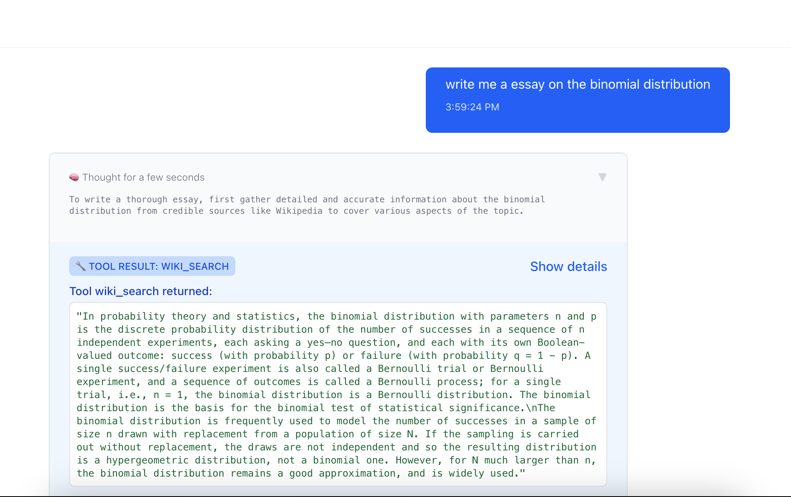
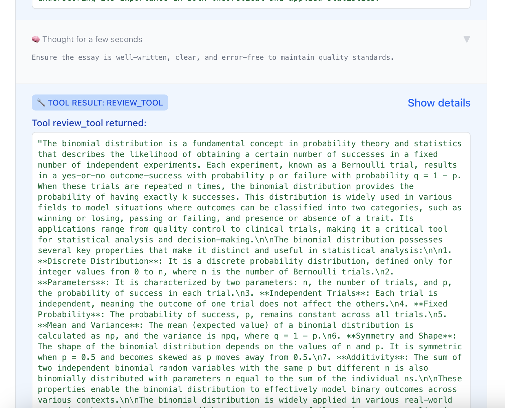
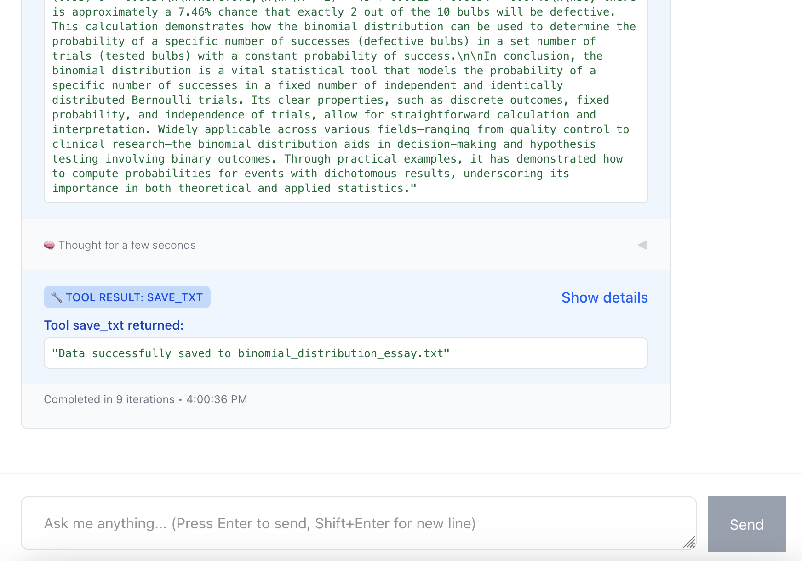

# Project Description

This is an essay writing AI agent. The idea is that we send a call to the OpenAI model. We provide tools to it, prompt and query. It then returns a plan with tasks that we must execute. Each task is a tool call.
Here is an example workflow/plan:

Query: Write an essay on the ...
Plan:

- Task 1

  - id
  - description
  - tool_calls
  - thought
  - status
  - stop
    ...

- Task n
  - id
  - description
  - tool_calls
  - thought
  - status
  - stop

We then execute each task

# How to run

### Start the Frontend

```
cd frontend
npm i
npm run dev
```

Go to [localhost](http://localhost:5173/)

### Start the MCP server

```
cd backend
uv venv
source .venv/bin/activate
make install
make mcp
```

### Start the Backend

```
cd backend
uv venv
source .venv/bin/activate
make install
make run
```

# Demo






