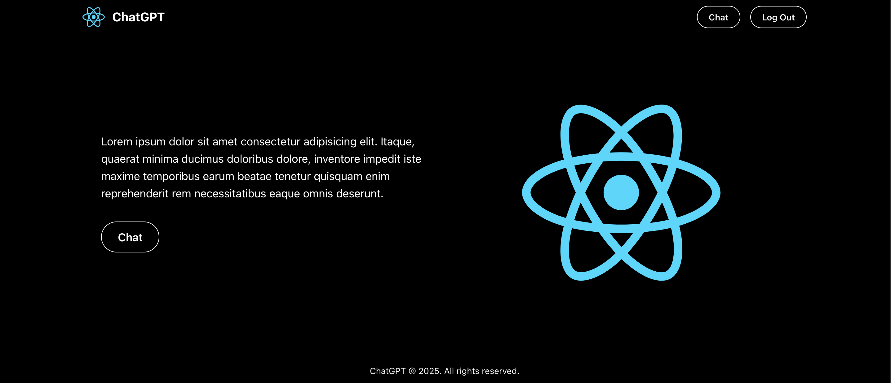
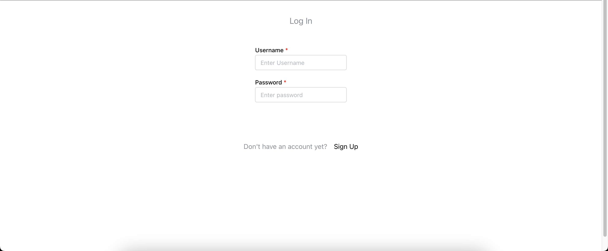
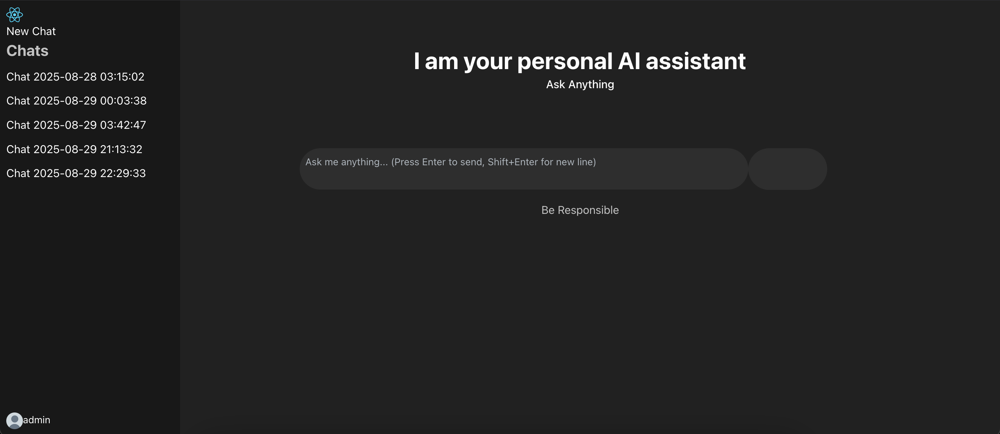
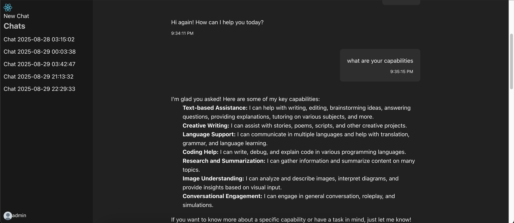

# Project Description

A ChatGPT clone I created using flask, react, typescript OpenAI api and Postgres. You can sign up, create, update and delete chats.

## How to Run

## Set Up Environment

In the backend you need to set up a `.env` file with the following

```
DATABASE_URL=
OPENAI_API_KEY=
COMPOSIO_API_KEY=
```

## Run

```sh
docker compose up --build
```

Or you can run them individually like this

```sh
cd ./backend
make install
make run

cd ./frontend
bun run dev


```

# Demo

Home Page


Log In Page


Chat Interface


Chat Example

